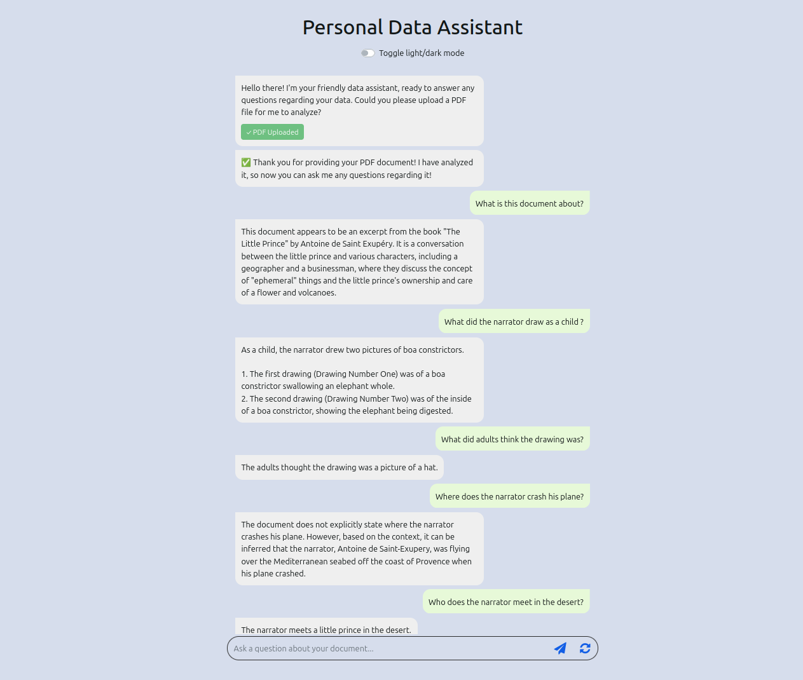

# Chatbot for Your Data (RAG-Powered Document Assistant)

[](https://www.python.org/)
[](https://flask.palletsprojects.com/)
[](https://www.langchain.com/)
[](https://console.groq.com/)
[](https://www.trychroma.com/)
[](https://www.docker.com/)
[](https://opensource.org/licenses/Apache-2.0)

A powerful Retrieval-Augmented Generation (RAG) chatbot that answers questions based on your PDF documents. Upload any PDF and start asking questions — the assistant will find relevant information and provide accurate answers using state-of-the-art LLMs.

<div align="center">
  <a href="screenshots/chatbot-interface.png">
    
  </a>
  <p><em>Interactive chatbot interface with light/dark mode support</em></p>
</div>

## ✨ Features

- 📄 **PDF Document Upload** – Upload any PDF, the system automatically processes and indexes it
- 💬 **Intelligent Q&A** – Ask questions in natural language, get accurate answers based on document content
- 🔍 **RAG Architecture** – Combines retrieval (ChromaDB) with generation (Groq LLM) for precise answers
- 🎨 **Modern UI** – Clean, responsive interface with light/dark mode toggle
- 🐳 **Docker Ready** – Run with a single command, no setup required
- ⚡ **Fast Responses** – Powered by Groq's ultra-fast inference API
- 🔒 **Privacy First** – Your documents stay on your machine (local processing)

## 🚀 Quick Start

### 1. Clone the Repository

```bash
git clone https://github.com/yourusername/chatbot-for-your-data.git
cd chatbot-for-your-data
```

### 2. Configure Environment Variables

- Copy the environment template

```bash
cp .env.example .env
```

- Edit .env with your Groq API key

**Getting a Groq API Key (Free)**:

- Visit [console.groq.com](https://console.groq.com)
- Sign up for a free account
- Go to **API Keys** → **Create API Key**
- Copy your key (starts with `gsk_`)

---

### 3. Choose Your Installation Method

You have two options to run the application. Choose the one that best fits your needs.

### Option 1: Run with Docker (Recommended)

No Python installation needed. Works on any operating system.

**Prerequisites**

- [Docker](https://docs.docker.com/get-started/get-docker/)
- [Docker compose](https://docs.docker.com/compose/install/)

**Installation Steps**

```bash
# Build and run with Docker Compose
docker-compose up -d

# Or run with Docker directly
docker build -t chatbot-for-your-data .
docker run -p 8000:8000 --env-file .env chatbot-for-your-data
```

Access the Application

Open your browser and go to: http://localhost:8000

Stop the Container

```bash
docker-compose down
```

### Option 2: Run Locally (without Docker)

You can run the application without Docker:

**Prerequisites**

- [Python 3.10+](https://www.python.org/downloads/)
- pip Latest
- [Git (Latest)](https://git-scm.com/install/)

**Installation Steps**

```bash
# Create virtual environment (recommended)
python -m venv .venv

# Activate virtual environment
# On Linux/macOS:
source .venv/bin/activate
# On Windows:
.venv\Scripts\activate

# Install dependencies
pip install -r requirements.txt

# Run the application
python run.py
```

**Access the Application:**

Open your browser and go to: http://localhost:8000

**Stop the Application:**

Press Ctrl+C in the terminal, then deactivate the virtual environment:

```bash
deactivate
```

## 🎯 How It Works

- 1. Document Upload: User uploads a PDF file
- 2. Text Extraction: PyPDFLoader extracts text from the PDF
- 3. Chunking: Text is split into overlapping chunks (1024 chars, 64 overlap)
- 4. Embeddings: Each chunk is converted to a vector (384 dimensions) using Sentence Transformers
- 5. Vector Storage: ChromaDB stores vectors for fast similarity search
- 6. Question Processing: User asks a question
- 7. Retrieval: System finds the most relevant document chunks using cosine similarity
- 8. Generation: Groq LLM (Llama 3.1) generates an answer based on the retrieved context
- 9. Response: Answer is displayed in the chat interface

## 🐛 Troubleshooting

**Docker Issues**

```sh

Problem	                      |     Solution
docker: command not found     |     Install Docker first (see prerequisites)
Permission denied (Linux)	    |     sudo usermod -aG docker $USER then logout/login
Port 8000 already in use	    |     Change port in docker-compose.yml: ports: "8080:8000"
Container exits immediately	  |     Check logs: docker logs <container_id>
```

**Groq API Issues**

```sh
Problem               |     Solution
GROQ_API_KEY not set  |     Ensure .env file exists with GROQ_API_KEY=your_key
Rate limit exceeded	  |     Free tier has limits. Wait a few seconds or upgrade
Model not available	  |     Use llama-3.1-8b-instant (free tier supported)
```

**Python Installation Issues**

```sh
Problem                     |     Solution
numpy: No module named      |     pip install numpy==1.26.4
np.float_ error             |     NumPy 2.0 incompatibility. Install NumPy 1.26.4
langchain version conflicts |     pip install -r requirements.txt (use exact versions)
```

### 🛠️ Technology Stack

```sh
Component               |     Technology
Backend Framework       |     Flask 3.1.0
LLM Provider            |     Groq (Llama 3.1 8B)
Vector Database         |     ChromaDB
Embeddings              |     Sentence Transformers (all-MiniLM-L6-v2)
Document Processing     |     PyPDF2, LangChain
Frontend                |     HTML5, CSS3, JavaScript, Bootstrap 4
Containerization        |     Docker, Docker Compose
```

---

<div align="center"> 
  <sub>Built with ❤️ for the open source community</sub> 
</div>
